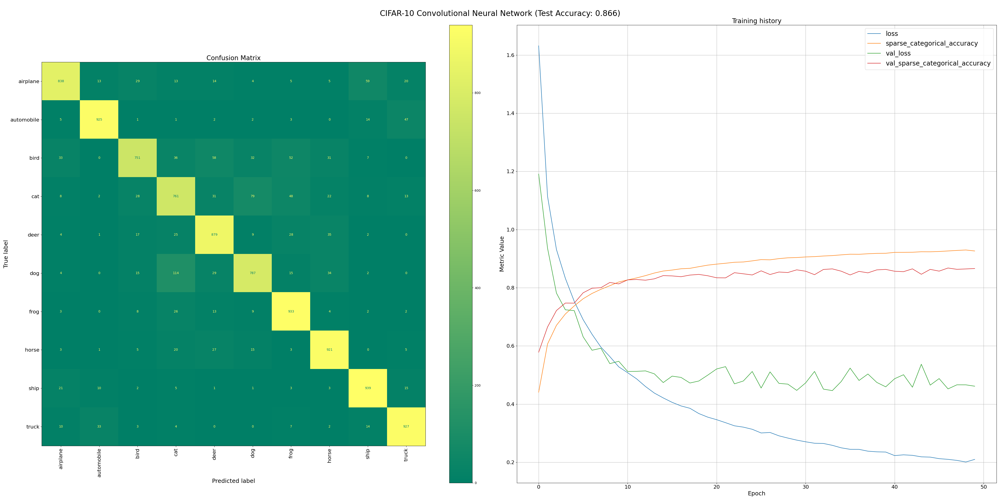
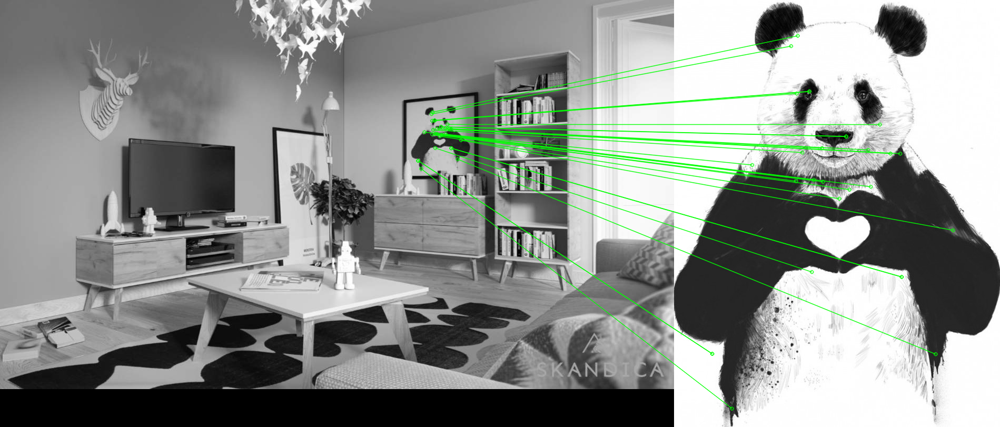

## [CIFAR-10 CNN](src/cifar10_cnn.py) - Convolutional Neural Network, 0.866 accuracy (Keras)

## [Feature Matching](src/feature_matching.py) - SIFT descriptions + flann knn match (OpenCV)

## [Red Ball Tracking](src/red_ball_tracking.py) - Tracks red ball on the video and draws bounding box (OpenCV)

## [Coin Detection](src/coin_detection.py) - Detects, counts and separates coins using (OpenCV)

## [Minifetch](src/minifetch.py) - Neofetch clone for debian based systems

## [RPS Markov](src/rps_markov.py) - "Rock, Paper, Scissors" vs Markov model that adjusts to your choices