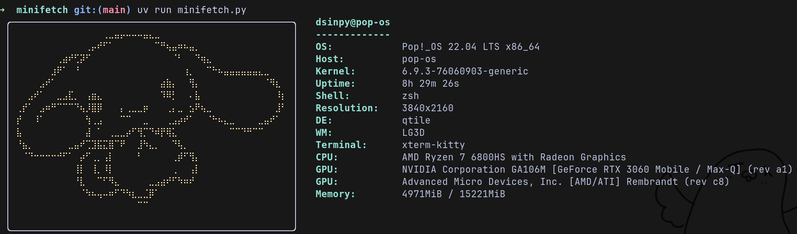
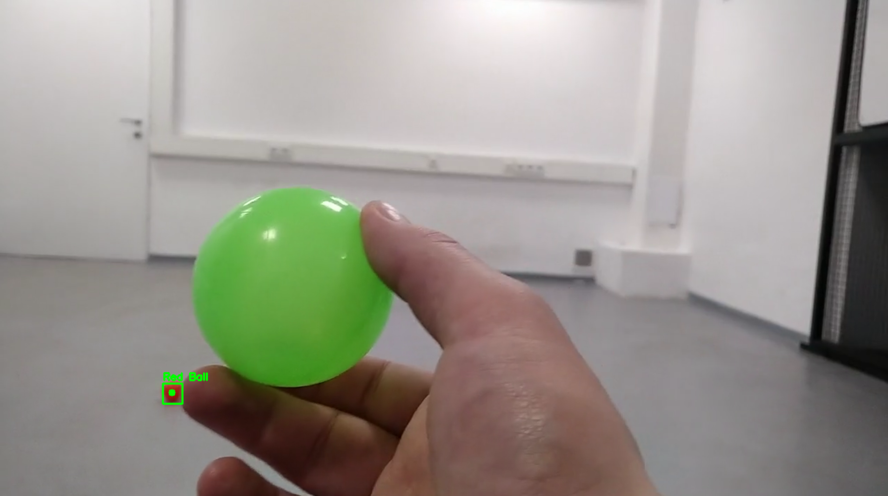
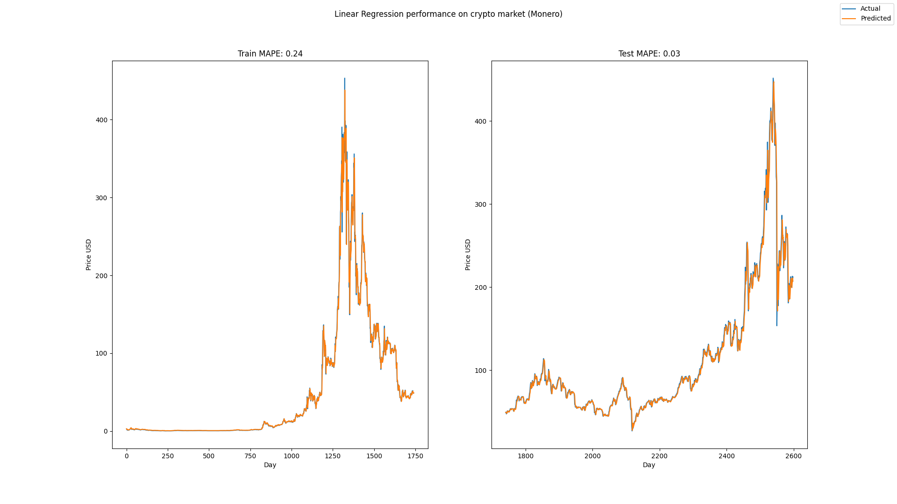

## Minifetch
    Neofetch clone for debian based systems:

## Red ball tracker
    Tracks red ball on the video and draws bounding box:

## RPS Markov
    "Rock, Paper, Scissors" vs Markov model that adjusts to your choices

## Crypto regression model
https://www.kaggle.com/datasets/sudalairajkumar/cryptocurrencypricehistory

    CLI scripts to generate crypto dataset like:
    $ generate_dataset.py -o dataset.csv monero.csv doge.csv bitcoin.csv

    And then create build Linear Regression like:
    $ run_regression --data dataset.csv --observation_window 3 --predicted_currency monero

    Note: of course it is just a statistical model and it won't predict actual spikes:

